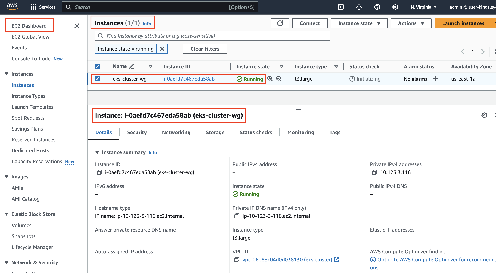
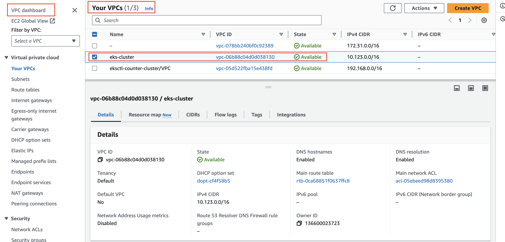

# Provisioning-and-managing-EKS-Cluster-using-using-Terraform


Elastic Kubernetes Service is a managed Kubernetes service provided by AWS, which automates key tasks such as deploying, managing, and scaling containerized applications. EKS runs Kubernetes control plane instances across multiple Availability Zones to ensure high availability. It integrates seamlessly with AWS services, providing a scalable and secure environment for running applications.

# Step 1: 

### 1. Install aws cli

```
brew install awscli
```

### 2. run the code below and fill in your account public and private keys

```
aws configure
```

### 3. run the code below to confirm access to aws account

```
aws s3 ls
```

### 4. run `code main.tf` and paste the code below

```
provider "aws" {
  region = local.region
}

locals {
  name   = "eks-cluster"
  region = "us-east-1"

  vpc_cidr = "10.123.0.0/16"
  azs      = ["us-east-1a", "us-east-1b"]

  public_subnets  = ["10.123.1.0/24", "10.123.2.0/24"]
  private_subnets = ["10.123.3.0/24", "10.123.4.0/24"]
  intra_subnets   = ["10.123.5.0/24", "10.123.6.0/24"]

  tags = {
    Example = local.name
  }
}

module "vpc" {
  source  = "terraform-aws-modules/vpc/aws"
  version = "~> 4.0"

  name = local.name
  cidr = local.vpc_cidr

  azs             = local.azs
  private_subnets = local.private_subnets
  public_subnets  = local.public_subnets
  intra_subnets   = local.intra_subnets

  enable_nat_gateway = true

  public_subnet_tags = {
    "kubernetes.io/role/elb" = 1
  }

  private_subnet_tags = {
    "kubernetes.io/role/internal-elb" = 1
  }
}

module "eks" {
  source  = "terraform-aws-modules/eks/aws"
  version = "19.15.1"

  cluster_name                   = local.name
  cluster_endpoint_public_access = true

  cluster_addons = {
    coredns = {
      most_recent = true
    }
    kube-proxy = {
      most_recent = true
    }
    vpc-cni = {
      most_recent = true
    }
  }

  vpc_id                   = module.vpc.vpc_id
  subnet_ids               = module.vpc.private_subnets
  control_plane_subnet_ids = module.vpc.intra_subnets

  # EKS Managed Node Group(s)
  eks_managed_node_group_defaults = {
    ami_type       = "AL2_x86_64"
    instance_types = ["m5.large"]

    attach_cluster_primary_security_group = true
  }

  eks_managed_node_groups = {
    eks-cluster-wg = {
      min_size     = 1
      max_size     = 2
      desired_size = 1

      instance_types = ["t3.large"]
      capacity_type  = "SPOT"

      tags = {
        ExtraTag = "helloworld"
      }
    }
  }

  tags = local.tags
}
```


# Step 2: main.tf code explanation 1

## AWS provider configuration
provider "aws" {
  region = local.region # Set the AWS region using a local variable
}

## Local variables for easy configuration and reusability
locals {
  name   = "eks-cluster" # Name for the EKS cluster
  region = "us-east-1"   # AWS region for the resources

  vpc_cidr = "10.123.0.0/16" # CIDR block for the VPC
  azs      = ["us-east-1a", "us-east-1b"] # Availability Zones

  ## Subnet configurations
  public_subnets  = ["10.123.1.0/24", "10.123.2.0/24"] # Public subnets
  private_subnets = ["10.123.3.0/24", "10.123.4.0/24"] # Private subnets
  intra_subnets   = ["10.123.5.0/24", "10.123.6.0/24"] # Intra subnets for EKS control plane

  tags = {
    Example = local.name # General tagging for resources
  }
}

## VPC module configuration
module "vpc" {
  source  = "terraform-aws-modules/vpc/aws"
  version = "~> 4.0"

  name = local.name # Name of the VPC
  cidr = local.vpc_cidr # CIDR block for the VPC

  ## Subnet configurations
  azs             = local.azs
  private_subnets = local.private_subnets
  public_subnets  = local.public_subnets
  intra_subnets   = local.intra_subnets

  enable_nat_gateway = true # Enable NAT Gateway for outbound internet access

  ## Tags for Kubernetes to identify subnet roles
  public_subnet_tags = {
    "kubernetes.io/role/elb" = 1
  }

  private_subnet_tags = {
    "kubernetes.io/role/internal-elb" = 1
  }
}

## EKS module configuration
module "eks" {
  source  = "terraform-aws-modules/eks/aws"
  version = "19.15.1"

  cluster_name                   = local.name # Name of the EKS cluster
  cluster_endpoint_public_access = true # Enable public access to the EKS endpoint

  ## Add-ons for EKS
  cluster_addons = {
    coredns = {
      most_recent = true
    }
    kube-proxy = {
      most_recent = true
    }
    vpc-cni = {
      most_recent = true
    }
  }

  ## VPC and subnet configurations for the EKS cluster
  vpc_id                   = module.vpc.vpc_id
  subnet_ids               = module.vpc.private_subnets
  control_plane_subnet_ids = module.vpc.intra_subnets

  ## Default configuration for EKS managed node groups
  eks_managed_node_group_defaults = {
    ami_type       = "AL2_x86_64"
    instance_types = ["m5.large"]

    attach_cluster_primary_security_group = true
  }

  ## Configuration for a specific EKS managed node group
  eks_managed_node_groups = {
    eks-cluster-wg = {
      min_size     = 1
      max_size     = 2
      desired_size = 1

      instance_types = ["t3.large"]
      capacity_type  = "SPOT" # Use spot instances for cost-efficiency

      tags = {
        ExtraTag = "helloworld" # Additional tagging for the node group
      }
    }
  }

  tags = local.tags # Apply general tags to the EKS cluster
}


# Step 3: main.tf code explanation 2

* This Terraform configuration script sets up an Amazon Web Services (AWS) infrastructure, including a Virtual Private Cloud (VPC), subnets, and an Elastic Kubernetes Service (EKS) cluster. Here's a breakdown of the key components and their purpose:

## Provider Configuration:

provider "aws": Specifies that AWS is the cloud provider.
region = local.region: Sets the AWS region to the value defined in the locals block (us-east-1).

## Local Values:

Defined for reusability and consistency across the configuration. Includes names, region, subnet CIDRs, and tags.

## Module "vpc":

Creates a VPC using the terraform-aws-modules/vpc/aws module.
Configures availability zones, public, private, and intra subnets.
Enables a NAT gateway for outbound internet access from private subnets.
Applies specific tags to public and private subnets for Kubernetes roles.

## Module "eks":

Sets up an EKS cluster using the terraform-aws-modules/eks/aws module.
Configures the cluster name, endpoint access, and addons like coredns, kube-proxy, and vpc-cni.
Specifies VPC and subnet IDs for the EKS cluster.
Defines EKS managed node group settings, including instance types, sizes, and capacity type (spot instances).
Tags are applied to the node groups for additional metadata.

## Key Points:

The script uses the concept of locals for defining common variables, which helps in maintaining consistency and ease of updates.
It segregates resources into public, private, and intra subnets, which is a good practice for network segmentation and security.
The EKS setup includes managed node groups with spot instances, which can be cost-effective.
Tags are used extensively for resource identification and could potentially integrate with cost allocation and management tools.

# Step 4: Run these codes to deploy resources

```
terraform fmt
```

```
terraform init
```

```
terraform plan
```

```
terraform apply -auto-approve
```

# Step 5: Visit AWS console to confirm eks deployment


==


==



==



==


==


==


# Step 6: Destroy the infrastructure to avoid unnecessary cost

```
terraform destroy
```